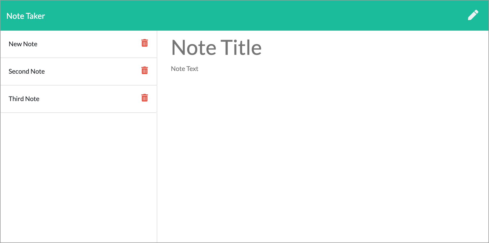
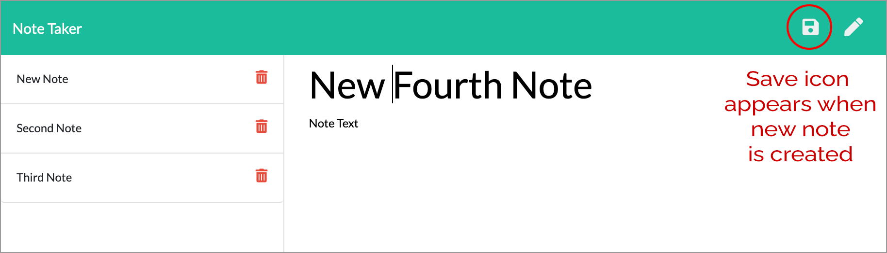
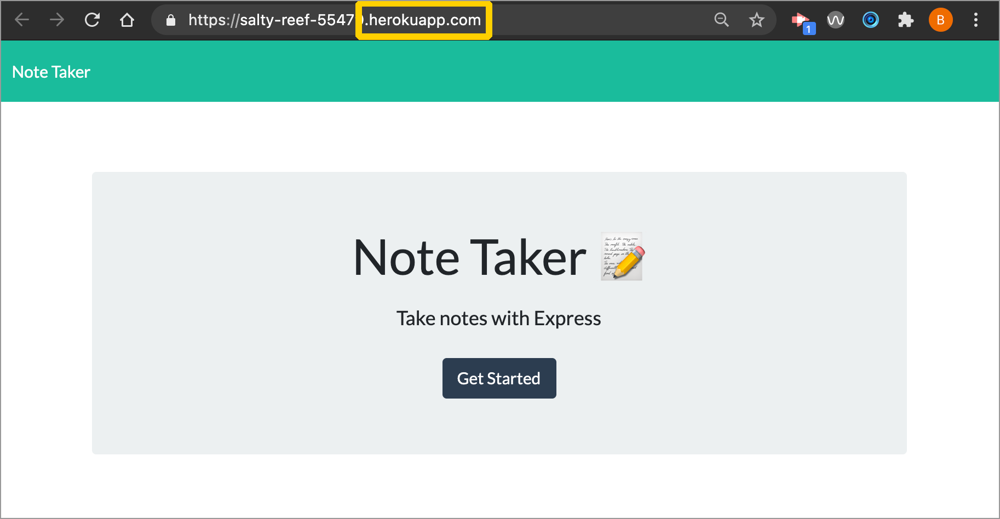

# 11 Express.js: Note Taker

## Table of Contents

- [Description](#program-description)
- [Installation](#installation-instructions)
- [Usage](#usage-information) 
- [DEMO VIDEO](#DEMO)
- [Screenshots](#screenshots)
- [Questions](#questions)

## Program Description
An application called Note Taker that can be used to write and save notes. It uses an Express.js back end and saves and retrieves note data from a JSON file. The app has been deployed to Heroku.

## URL and Repo Location
#### The urls for Note Taker are:
* [Link to Heroku deployed site - https://quinlan-note-taker.herokuapp.com/](https://quinlan-note-taker.herokuapp.com/)
#### The repo is located here: 
* [Link to repo - https://github.com/brandyquinlan/Note-Taker/](https://github.com/brandyquinlan/Note-Taker/)

## Installation Instructions
  Run the command "npm i" to install dependencies

### Usage information
  To use the application, run the command "node server.js"
 
## DEMO
* [Link to demo - https://drive.google.com/file/d/1jwXJ7E5pGla5IsqtbtQFy5oEWfJF2Gd-/view?usp=sharing](https://drive.google.com/file/d/1jwXJ7E5pGla5IsqtbtQFy5oEWfJF2Gd-/view?usp=sharing)

## Screenshots

### Note Taker Home Page

### Note Taker Notes Page

### Note Taker Save Button

### Note Taker Deployed to Heroku
[Link to Heroku deployed site - https://salty-reef-55479.herokuapp.com/](https://salty-reef-55479.herokuapp.com/)<br>


### User Story
```
AS A small business owner
I WANT to be able to write and save notes
SO THAT I can organize my thoughts and keep track of tasks I need to complete
```

### Acceptance Criteria
```
GIVEN a note-taking application
WHEN I open the Note Taker
    THEN I am presented with a landing page with a link to a notes page
WHEN I click on the link to the notes page
    THEN I am presented with a page with existing notes listed in the left-hand column, plus empty fields to enter a new note title and the note’s text in the right-hand column
WHEN I enter a new note title and the note’s text
    THEN a Save icon appears in the navigation at the top of the page
WHEN I click on the Save icon
    THEN the new note I have entered is saved and appears in the left-hand column with the other existing notes
WHEN I click on an existing note in the list in the left-hand column
    THEN that note appears in the right-hand column
WHEN I click on the Write icon in the navigation at the top of the page
    THEN I am presented with empty fields to enter a new note title and the note’s text in the right-hand column
```

## Questions
Please contact me with questions:

Brandy Quinlan
<br>
Email: <brandyquinlan@gmail.com>
<br>
Github: [https://github.com/brandyquinlan/](https://github.com/brandyquinlan/)
